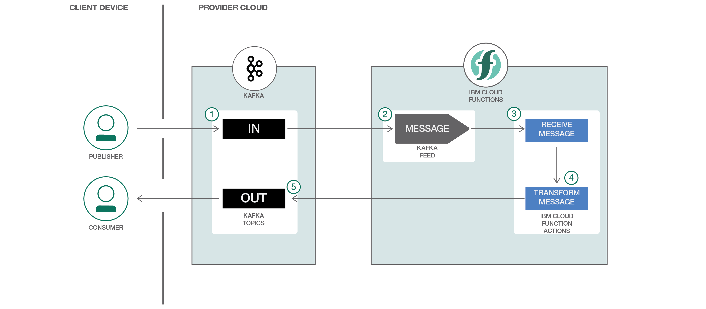

[](https://travis-ci.org/IBM/openwhisk-data-processing-message-hub)

# Message Hub data processing with OpenWhisk
This project shows the power of serverless, event-driven architectures to execute code in response to messages or to handle streams of data records.

It demonstrates two OpenWhisk actions (written in JavaScript) that read and write messages with Message Hub (based on Apache Kafka). The use case demonstrates how actions can work with data services and execute logic in response to message events.

One action receives message streams of one or more data records, and these are in turn piped to another action in an OpenWhisk sequence (a way to link actions declaratively in a chain). The second action aggregates the message and posts a transformed message to another topic.



## Included components

- OpenWhisk
- Message Hub (Kafka)

## Prerequisite

You should have a basic understanding of the OpenWhisk programming model. If not, [try the action, trigger, and rule demo first](https://github.com/IBM/openwhisk-action-trigger-rule).

Also, you'll need a Bluemix account and the latest [OpenWhisk command line tool (`wsk`) installed and on your PATH](https://github.com/IBM/openwhisk-action-trigger-rule/blob/master/docs/OPENWHISK.md).

As an alternative to this end-to-end example, you might also consider the more [basic "building block" version](https://github.com/IBM/openwhisk-message-hub-trigger) of this sample.

## Steps

1. [Provision Message Hub](#1-provision-mysql)
2. [Create OpenWhisk actions, triggers, and rules](#2-create-openwhisk-actions-triggers-and-rules)
3. [Test new message events](#3-test-new-message-events)
4. [Delete actions, triggers, and rules](#4-delete-actions-triggers-and-rules)
5. [Recreate deployment manually](#5-recreate-deployment-manually)


# 1. Provision Message Hub
Log into Bluemix, provision a [Message Hub](https://console.ng.bluemix.net/catalog/services/message-hub) instance, and name it `kafka-broker`. On the "Manage" tab of your Message Hub console create two topics: _in-topic_ and _out-topic_.

Copy `template.local.env` to a new file named `local.env` and update the `KAFKA_INSTANCE_NAME`, `SRC_TOPIC`, and `DEST_TOPIC` values for your instance if they differ. Update the `API_KEY`, `USER`, and `PASSWORD` values from the "Credentials" tab.

# 2. Create OpenWhisk actions, triggers, and rules
`deploy.sh` is a convenience script reads the environment variables from `local.env` and creates the OpenWhisk actions, triggers, and rules on your behalf. Later you will run these commands yourself.

```bash
./deploy.sh --install
```
> **Note**: If you see any error messages, refer to the [Troubleshooting](#troubleshooting) section below.

> **Note**: If you see any error messages, refer to the [Troubleshooting](#troubleshooting) section below. You can also explore [Alternative deployment methods](#alternative-deployment-methods).

# 3. Test new message events
Open one terminal window to poll the logs:
```bash
wsk activation poll
```

There are two helper scripts that simulate a message producer and a message consumer.
```bash
# Produce a message, will trigger the sequence
./kafka_publish.sh

# Consume a message after processing is complete
./kafka_consume.sh
```

# 4. Delete actions, triggers, and rules
Use `deploy.sh` again to tear down the OpenWhisk actions, triggers, and rules. You will recreate them step-by-step in the next section.

```bash
./deploy.sh --uninstall
```

# 5. Recreate deployment manually
This section provides a deeper look into what the `deploy.sh` script executes so that you understand how to work with OpenWhisk triggers, actions, rules, and packages in more detail.

## 5.1 Create Kafka message trigger
Create the `kafka-trigger` trigger that listens for new messages.

```bash
wsk trigger create kafka-trigger \
  --feed /_/Bluemix_${KAFKA_INSTANCE_NAME}_Credentials-1/messageHubFeed \
  --param isJSONData true \
  --param topic ${SRC_TOPIC}
```

## 5.2 Create action to consume message
Upload the `mhget-action` action as a single file Node.js action. This downloads messages when they arrive via the trigger.

```bash
wsk action create mhget-action actions/mhget/mhget.js
```

## 5.3 Create action to aggregate and send back message
Upload the `mhpost-action` action as a zipped action, in order to include dependencies that are not in the default Node.js environment on OpenWhisk. This aggregates information from the action above, and sends the summary JSON back to Kafka.

```bash
DIR=`pwd`
cd actions/mhpost
npm install --loglevel=error
zip -r mhpost.zip *
cd ${DIR}
wsk action create mhpost-action actions/mhpost/mhpost.zip --kind nodejs:6 \
  --param api_key ${API_KEY} \
  --param kafka_rest_url ${KAFKA_REST_URL} \
  --param topic ${DEST_TOPIC}
```

## 5.4 Create sequence that links get and post actions
Declare a linkage between the `mhget-action` and `mhpost-action` in a sequence named `kafka-sequence`.

```bash
wsk action create kafka-sequence --sequence mhget-action,mhpost-action
```

## 5.5 Create rule that links trigger to sequence
Declare a rule named `kafka-inbound-rule` that links the trigger `kafka-trigger` to the sequence named `kafka-sequence`.

```bash
wsk rule create kafka-inbound-rule kafka-trigger kafka-sequence
```

## 5.6 Test new message events
```bash
# Produce a message, will trigger the sequence
./kafka_publish.sh

# Consume a message after processing is complete
./kafka_consume.sh
```
# Troubleshooting
Check for errors first in the OpenWhisk activation log. Tail the log on the command line with `wsk activation poll` or drill into details visually with the [monitoring console on Bluemix](https://console.ng.bluemix.net/openwhisk/dashboard).

If the error is not immediately obvious, make sure you have the [latest version of the `wsk` CLI installed](https://console.ng.bluemix.net/openwhisk/learn/cli). If it's older than a few weeks, download an update.
```bash
wsk property get --cliversion
```

# Alternative deployment methods
`deploy.sh` will be replaced with [`wskdeploy`](https://github.com/openwhisk/openwhisk-wskdeploy) in the future. `wskdeploy` uses a manifest to deploy declared triggers, actions, and rules to OpenWhisk.

You can also use the following button to clone a copy of this repository and deploy to Bluemix as part of a DevOps toolchain. Supply your OpenWhisk and Cloudant credentials under the Delivery Pipeline icon, click Create, then run the Deploy stage for the Delivery Pipeline.

[](https://bluemix.net/deploy?repository=https://github.com/IBM/openwhisk-data-processing-message-hub.git&branch=add_deploy_to_bluemix)

# License
[Apache 2.0](LICENSE.txt)

# Credits
This project was inspired by and reuses significant amount of code from [this article](https://medium.com/openwhisk/transit-flexible-pipeline-for-iot-data-with-bluemix-and-openwhisk-4824cf20f1e0#.talwj9dno).
